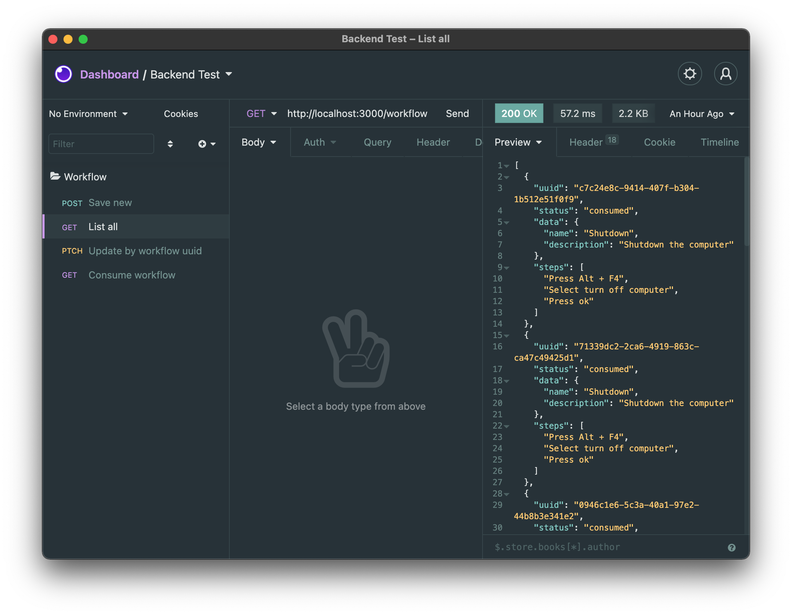

# Backend Test - N1

Develop the workflow's REST API following the specification bellow

## Delivery instructions

Use a private repository in the [GitHub](https://github.com/), [Gitlab](https://about.gitlab.com/) or [Bitbucket](https://bitbucket.org/). When you finished, send an email to <marioidival@gmail.com>. We'll follow your instructions to run your code and look the outcome. 

## Defining a workflow

|Name|Type|Description|
|-|-|-|
|UUID|UUID|workflow unique identifier|
|status|Enum(inserted, consumed)|workflow status|
|data|JSONB|workflow input|
|steps|Array|name of workflow steps

## Endpoints

|Verb|URL|Description|
|-|-|-|
|POST|/workflow|insert a workflow on database and on queue and respond request with the inserted workflow|
|PATCH|/workflow/{UUID}|update status from specific workflow|
|GET|/workflow|list all workflows|
|GET|/workflow/consume|consume a workflow from queue and generate a CSV file with workflow.Data|

## Technologies

- Python, NodeJS, Go, Rust are more suitable, however you can use another one that feels more comfortable 
- Database PostgreSQL
- We have indicated RabbitMQ as a messaging service, but if you are going to choose another one, please tell us why

## Solution - Rogério Araújo

To perform the test use the following technologies: 
- NodeJS, PostgreSQL and Docker. 

#### Technologies Used

- [PostgreSQL](https://www.postgresql.org/) - The World's Most Advanced Open Source Relational Database
- [Typescript](https://www.typescriptlang.org/) - TypeScript extends JavaScript by adding types to the language
- [Node.js](https://nodejs.org/en/) - Node.js® is a JavaScript runtime built on Chrome's V8 JavaScript engine.
- [Express.js](https://expressjs.com/) - Express is a minimal and flexible Node.js web application framework that provides a robust set of features for web and mobile applications.
- [TypeORM](https://typeorm.io/#/) - TypeORM is an ORM that can run in NodeJS, Browser, Cordova, PhoneGap, Ionic, React Native, NativeScript, Expo, and Electron platforms and can be used with TypeScript and JavaScript (ES5, ES6, ES7, ES8).
- [Docker](https://www.docker.com/) - Docker is a set of platform-as-a-service products that use operating system-level virtualization to deliver software in packages called containers

## Folders / Files Structure

Here is a high-level overview of our file structure.

```
src/
  config/
  packages/
    api/ # API helpers, middlewares, resources, controllers, validations
    database/ # database helpers, models, database migrations
  index.ts
  server.ts
tests/ # tests
README.md
package.json, etc...
```

## Environment Variables

```
NODE_ENV=""

# DATABASE
DB_HOST=""
DB_NAME=""
DB_PASSWORD=""
DB_PORT=""
DB_USERNAME=""
DB_MAIN_SCHEMA=""

# RABBITMQ
RABBITMQ_USER=""
RABBITMQ_PASSWORD=""
RABBITMQ_HOST=""
RABBITMQ_PORT=""

# LOGGING
LOGGING_COMBINED_FILE=""
LOGGING_ERROR_FILE=""
LOGGING_LEVEL=""
LOGGING_TYPE=""

# SERVER
SERVER_PORT=""

```

## Setup

### Local
1. Create a `.env` file on the root of the project based on `.env.example`
2. Start RabbitMQ server and PostgreSQL using docker (or how to prefer), running:
```sh
 docker-compose -f docker-compose.dev.yml up --build
 ```
 > Necessary to have the docker installed.

3. Execute `$ npm run migration:run`, to setup database migrations on PostgreSQL
4. Start the development server running `$ npm run dev`

### Docker
1. Start the API Server, RabbitMQ and PostgreSQL, running:
```sh
 docker-compose up --build
 ```
 > Necessary to have the docker installed.
 > Need to create a queue `workflows` in RabbitMQ, see image bellow:
 

## Using the application

Then, let's play around the application!

For showing that, I gonna use Insomnia as HTTP client, but feel free to use any other you wish.

### POST /workflow

To create a Workflow, you just need to POST the workflow data and steps array

```json
{
	"data": {
		"name": "Shutdown",
		"description": "Shutdown the computer"
	},
	"steps": [
		"Press Alt + F4",
		"Select turn off computer",
		"Press ok"
	]
}
```

to the URL `http://localhost:3000/workflow` as you can see in the image below:


### PATCH /workflow

To update a Workflow status, we need to PATCH request with the status, by using the URL `http://localhost:3000/workflow/{WORKFLOW_UUID}`, as you can see in the image below
```json
{
	"status": "consumed"
}
```


### GET /workflow

To get a JSON array of all wofklows in the database, you just need to send a GET request to the URL `http://localhost:3000/workflow`, then you can see all workflows saved in database, as you can see in the image below



### GET /workflow/consume

For that, we can see that by GET from `http://localhost:3000/workflow/consume` we gonna receive a attachment file representing the CSV of the field `workflow.data` at the top of the `Queue` with the inserted status.


When consuming a workflow, a .csv file is generated in the `sheets` folder, see: 


## Running Tests

1. Create a `.env` file on the root of the project based on `.env.example`
2. Start RabbitMQ server and PostgreSQL using docker (or how to prefer), running:
```sh
 docker-compose -f docker-compose.dev.yml up --build
 ```
 > Necessary to have the docker installed.

3. Execute `$ npm run migration:run`, to setup database migrations on PostgreSQL

4. Run `$ npm test`


## Difficulties
I've had some difficulties to understand what should I do when update a workflow, if I should add again a workflow in the queue if the status was updated from consumed to inserted, for this last, I assumed that I should.

### Thanks
First of all, I would like to thank you for being able to participate in the test for the back-end vacancy and say that I learned a lot while taking this test. 